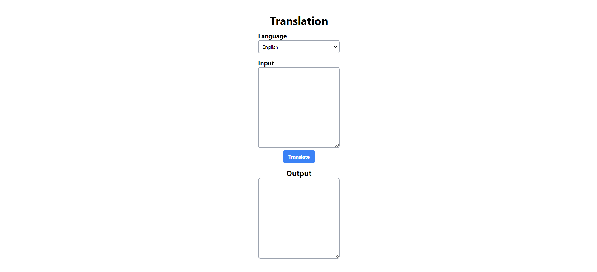

# Coursera Python AI Project 🌐
[](https://www.coursera.org/)

Coursera Python AI Project is a Flask-based application designed to translate English language text to French and vice-versa. This project was created to fulfill the requirements of the IBM Full Stack Development Coursera assignment. [](https://www.coursera.org/)

🚀 **Open for Contribution** - We invite contributors to enhance Coursera Python AI Project!

[](CONTRIBUTING.md)
[](LICENSE)

## Features

- 🌍 Translate English to French or French to English.
- 🖥️ Simple and user-friendly web interface.
- 📊 Utilizes the IBM Language Translator API.
- 📚 Educational project for learning Flask and language translation.

## Installation

To run Coursera Python AI Project locally, follow these steps:

1. **Clone the Repository:**

   ```bash
   git clone https://github.com/Ravikisha/Coursera-Python-AI-Project.git
   cd Coursera-Python-AI-Project
   ```

2. **Set Up a Virtual Environment:**

   Create a virtual environment for isolation.

   ```bash
   python -m venv venv
   source venv/bin/activate
   ```

3. **Install Dependencies:**

   Install the required Python packages.

   ```bash
   pip install -r requirements.txt
   ```

4. **Set the `server.py` File into Flask App:**
   ```bash
    export FLASK_APP=server.py
   ```

5. **Run the Application:**

   Start the Flask app.

   ```bash
   flask run
   ```

6. **Access the Application:**

   Open your web browser and go to `http://localhost:5000` to use the translation service.

## Screenshots


## Contributing

We encourage contributions! If you'd like to contribute to Coursera Python AI Project, please review the [CONTRIBUTING.md](CONTRIBUTING.md) file for guidelines and tips.

## License

This project is licensed under the MIT License. See the [LICENSE](LICENSE) file for details.

Explore the world of language translation with Coursera Python AI Project! 🌍🇫🇷🇺🇸
